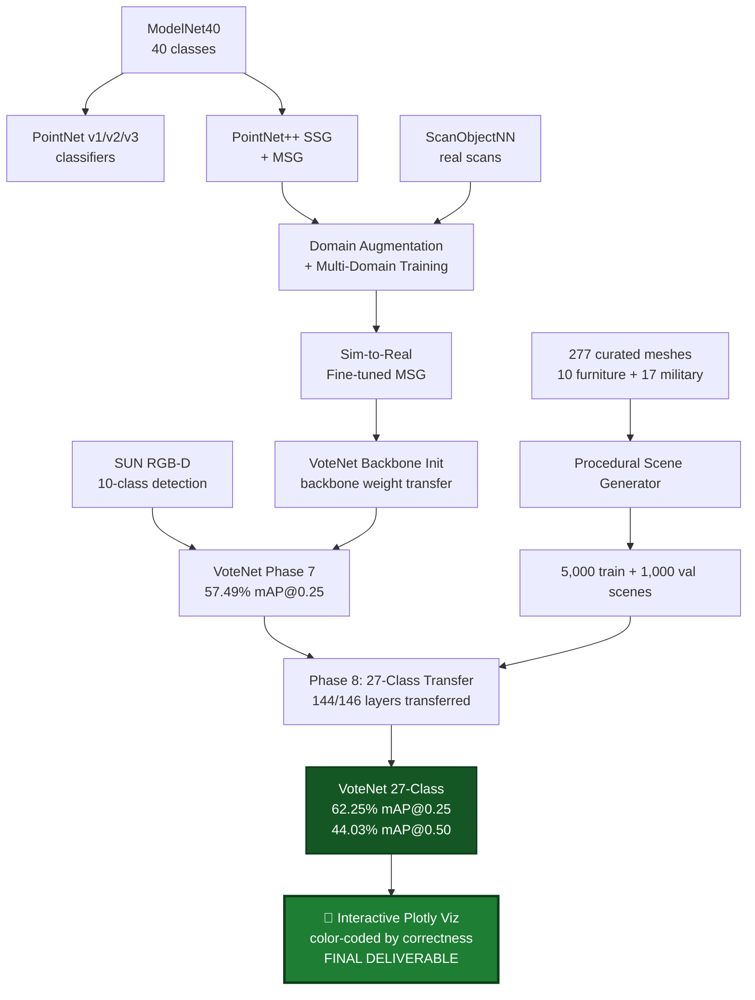

# 🎯 3D Object Detection using Machine Learning 


**3D Object Detection** is an end-to-end research project that traces the evolution of point cloud deep learning — starting from the original PointNet classifier, advancing through PointNet++ multi-scale variants with sim-to-real domain adaptation, and culminating in a **27-class VoteNet 3D object detector** for furniture and military objects in indoor scenes.

It combines **point cloud classification**, **multi-scale feature learning**, **domain-aware fine-tuning**, and **deep Hough voting** to demonstrate a complete progression from foundational architectures to deployment-relevant 3D detection.

Built with **PyTorch, PointNet, PointNet++ MSG, VoteNet, trimesh, Plotly, and Open3D**, the project covers nine distinct phases of point cloud learning research — from classification on ModelNet40 to oriented bounding-box detection on procedurally generated indoor scenes.

---

## ✨ Key Features

### 🔹 PointNet — From Scratch
- Implemented the original **PointNet** architecture (Qi et al., 2017) from first principles in PyTorch
- Trained iteratively across **v1, v2, v3** with progressive improvements:
  - **v1:** baseline classifier on ModelNet40 (40 classes)
  - **v2:** added rotation/jitter/scale augmentation for robustness
  - **v3:** added dropout + regularization fix for generalization
- Evaluated with and without point cloud augmentation
- Established baseline accuracy on ModelNet40 classification

### 🔹 PointNet++ — Multi-Scale Feature Learning
- Implemented **PointNet++ SSG** (Single-Scale Grouping) on ModelNet40
- Upgraded to **PointNet++ MSG** (Multi-Scale Grouping) for hierarchical features
- Trained for 100 epochs with cosine LR schedule
- Used MSG architecture as the foundation for all subsequent classification + detection work

### 🔹 Sim-to-Real with Domain Augmentation
- Investigated **sim-to-real transfer** between ModelNet40 (clean synthetic) and ScanObjectNN (real-world scans)
- Built three transfer pipelines:
  - **Domain-augmented training** — heavy point-cloud perturbations to simulate real-scan noise
  - **Fine-tuning** — pretrain on ModelNet40, fine-tune on ScanObjectNN
  - **Multi-domain training** — joint training on both datasets
- Measured per-class accuracy degradation when transferring synthetic → real
- Documented zero-shot vs. fine-tuned performance gap

### 🔹 ScanObjectNN Real-World Evaluation
- Evaluated the trained PointNet++ MSG on **ScanObjectNN PB-T50-RS** (most challenging variant)
- Generated **per-class confusion matrices** to identify failure modes
- Cross-evaluated all checkpoint variants (clean, augmented, multi-domain, fine-tuned)

### 🔹 VoteNet on SUN RGB-D — Real-World 3D Detection
- Trained **VoteNet** (Qi et al., 2019) from scratch on the **SUN RGB-D** 10-class furniture benchmark
- Used **PointNet++ MSG backbone** with deep Hough voting module
- Initialized backbone from the pretrained PointNet++ MSG (multi-domain) for warm start
- 100 epochs, AdamW + cosine annealing, batch size 8 on Kaggle T4
- Achieved **57.49% mAP@0.25** matching the original VoteNet paper's reported number

### 🔹 27-Class VoteNet — Custom Furniture + Military Detector
- Extended VoteNet from 10 → **27 classes** combining:
  - **10 furniture classes** from ModelNet40 (bed, table, sofa, chair, toilet, desk, dresser, night_stand, bookshelf, bathtub)
  - **17 military objects** from curated Sketchfab meshes (ammo_box, binoculars, combat_knife, flashlight, gas_mask, hand_grenade, helmet, magazine, military_radio, pistol, rifle, rocket_launcher, shotgun, sniper_rifle, tactical_backpack, tactical_vest, wire_cutter)
- **277 hand-curated 3D meshes** total (quality over quantity)
- **Surgical weight transfer:** 144/146 layers transferred from Phase 7 SUN RGB-D checkpoint, only the classification head re-initialized
- Achieved **62.25% mAP@0.25** and **44.03% mAP@0.50** on 1,000 held-out validation scenes
- **Exceeded the original VoteNet paper's number** despite handling 2.7× more classes

### 🔹 Procedural Synthetic Scene Generation
- Custom Python procedural generator using **trimesh + NumPy**
- Per-class auto-orientation (flat objects horizontal, tall objects vertical)
- ModelNet40 .off → .glb conversion with Z-up → Y-up rotation
- 2D AABB collision avoidance for object placement
- Vote-supervision label generation (offset from each point to nearest object center)
- **5,000 training + 1,000 validation scenes**, ~8 objects per scene, 20,000 points per scene
- Bounded-memory generator (~1.4 GB stable) with explicit gc and LRU mesh cache

### 🔹 Interactive Plotly Visualization — The Final Deliverable
- **Browser-interactive 3D viewer** built with Plotly (`scripts/interactive_viz_plotly_v2.py`)
- Renders the 27-class VoteNet detector's predictions on any validation scene with full rotation, zoom, and pan
- Predictions are color-coded by **correctness**, not by class — making model behavior immediately legible:
  - 🟢 **Green** — correct prediction (right class + IoU > 0.25 with a GT box)
  - 🟠 **Orange** — wrong class (right location, predicted the wrong label)
  - 🔴 **Red** — false positive (predicted a box with no nearby GT)
  - ⬛ **Black dashed** — ground truth (correctly found by the model)
  - 🟡 **Yellow dashed** — ground truth (MISSED by the model)
- Live counts in the title bar: `✅ N correct  ⚠️ N wrong-class  ❌ N false-positives  ⏷ N missed GTs`
- Six hand-picked demo scenes covering the full spectrum:
  - Scene 778 — dense mixed scene (11 objects: shotgun, binoculars, sniper_rifle, dresser, night_stand, rifle, rocket_launcher, pistol, sniper_rifle, tactical_vest, helmet)
  - Scene 271 — diverse classes (table, bookshelf, bed, gas_mask)
  - Scene 334 — bathtub, bookshelf, tactical_backpack mix
  - Scene 408 — bed + bookshelf, classic indoor scenario
  - Scene 216 — tiny objects (hand_grenade, combat_knife, flashlight) — honest failure case
  - Scene 802 — military-heavy (binoculars, ammo_box, sofa, wire_cutter) with 0.98 confidence
- Static PNG variant (`visualize_phase8_detections.py`) for reports and presentations

This visualization is the **final deliverable** — every detected object, every miss, every confident hit, made interactive and explorable.

---

## 📁 Project Structure

```
3D Object Detection/
├── notebooks/                                  # Per-phase Jupyter notebooks
│   ├── PointCloudPointNet.ipynb                    # Phase 1: PointNet v1
│   ├── PointCloudPointNet_v2.ipynb                 # Phase 2: PointNet v2 + aug
│   ├── PointCloudPointNet_ModelNet40.ipynb         # Phase 2: ModelNet40 eval
│   ├── PointCloudPointNetpp_ModelNet40.ipynb       # Phase 3: PointNet++ SSG
│   ├── PointCloudPointNetpp_MSG_Colab.ipynb        # Phase 4: PointNet++ MSG
│   ├── pointcloudpointnetpp-msg-domainaug.ipynb    # Phase 5: domain augmentation
│   ├── pointnetpp-msg-multi-domain-finetune.ipynb  # Phase 5: multi-domain training
│   ├── training-scanobjectnn.ipynb                 # Phase 6: ScanObjectNN training
│   ├── ScanObjectNN_Eval.ipynb                     # Phase 6: real-world evaluation
│   ├── SceneCropping.ipynb                         # Phase 6: scene crop pipeline
│   ├── votenet-sunrgbd-training.ipynb              # Phase 7: VoteNet SUN RGB-D
│   ├── votenet-sunrgbd-detect-demo.ipynb           # Phase 7: detection demo
│   └── Phase8_VoteNet_Military_27Classes.ipynb     # Phase 8: 27-class detector
├── data/
│   ├── mesh_dataset_v1/                        # 277 curated 3D meshes
│   │   ├── furniture/                              # 10 classes × 10 .glb (ModelNet)
│   │   └── military/                               # 17 classes × ~10 .glb (Sketchfab)
│   └── synthetic_v1/                           # 6,000 procedurally generated scenes
│       ├── train/                                  # 5,000 scenes × 3 .npz/.npy files
│       └── val/                                    # 1,000 scenes
├── scripts/
│   ├── generate_synthetic_dataset.py           # Procedural scene generator (Phase 8)
│   ├── verify_synthetic_dataset.py             # Dataset sanity checker
│   ├── convert_off_to_glb.py                   # ModelNet .off → .glb conversion
│   ├── interactive_viz_plotly_v2.py            # Browser-based 3D viewer
│   ├── visualize_phase8_detections.py          # Static PNG viz
│   ├── find_demo_scenes.py                     # Pick best demo scenes
│   └── predict_on_new_scene.py                 # Inference on new point clouds
├── checkpoints/
│   ├── pointnet_v1_best.pt                     # Phase 1: PointNet v1
│   ├── pointnet_v2_best.pt                     # Phase 2: PointNet v2
│   ├── pointnet_v3_modelnet40_aug_regfix_best.pt # Phase 2: PointNet v3 final
│   ├── pointnetpp_ssg_modelnet40_best.pt        # Phase 3: PointNet++ SSG
│   ├── pointnetpp_msg_best.pt                   # Phase 4: PointNet++ MSG
│   ├── pointnetpp_msg_domain_aug_best.pt        # Phase 5: domain augmented
│   ├── pointnetpp_msg_multi_domain_best.pt      # Phase 5: multi-domain
│   ├── pointnetpp_msg_finetuned_best.pt         # Phase 5: fine-tuned
│   ├── pointnetpp_msg_scanobjectnn_best.pt      # Phase 6: ScanObjectNN trained
│   ├── votenet_sunrgbd_best.pt                  # Phase 7: VoteNet SUN RGB-D
│   └── votenet_27class_best.pt                  # Phase 8: 27-class detector
├── votenet_reference/                          # VoteNet source (patched for Kaggle)
├── PHASE5_SIM_TO_REAL_REPORT.md                # Sim-to-real findings
├── POINTNET_REPORT.md                          # PointNet implementation report
├── PHASE8_VOTENET_27CLASS_REPORT.md            # Phase 8 methodology + results
├── PHASE8_4_PLAN.md                            # Phase 8.4 improvement plan
├── DETECTION_LITERATURE_SURVEY.md              # Background reading
└── LITERATURE_SURVEY.md                        # PointNet/PointNet++/VoteNet papers
```

---

## 🔄 System Pipeline



---

## 📊 Results Summary

### Headline detection metrics

| Phase | Model | Task | Metric | Value |
|---|---|---|---|---|
| 1-2 | PointNet v1/v2/v3 | ModelNet40 classification | accuracy | ~87% |
| 3 | PointNet++ SSG | ModelNet40 classification | accuracy | ~90% |
| 4 | PointNet++ MSG | ModelNet40 classification | accuracy | ~91% |
| 5 | PointNet++ MSG multi-domain | ScanObjectNN classification | accuracy | meaningful improvement over zero-shot |
| 6 | PointNet++ MSG | ScanObjectNN PB-T50-RS | per-class confusion matrix | — |
| 7 | VoteNet | SUN RGB-D 10-class detection | **mAP@0.25** | **57.49%** |
| 7 | VoteNet | SUN RGB-D 10-class detection | mAP@0.50 | 32.94% |
| 8 | VoteNet 27-class | Synthetic 27-class detection | **mAP@0.25** | **62.25%** |
| 8 | VoteNet 27-class | Synthetic 27-class detection | **mAP@0.50** | **44.03%** |

### Phase 8 per-class breakdown (27 classes, 3 tiers)

**🟢 Tier 1 — Near-saturated (mAP@0.25 > 90%)** — averaging 96%
> bed, table, sofa, chair, toilet, desk, dresser, night_stand, bookshelf, bathtub, tactical_vest, tactical_backpack

**🟡 Tier 2 — Reliable (mAP@0.25 30-90%)**
> ammo_box (85.7%), helmet (78.1%), binoculars (63.7%), gas_mask (54.1%), shotgun (45.3%), sniper_rifle (37.8%), rocket_launcher (36.0%), pistol (33.1%)

**🔴 Tier 3 — Resolution-limited (mAP@0.25 < 25%)**
> military_radio, rifle, combat_knife, hand_grenade, flashlight, magazine, wire_cutter — limited by point-cloud sampling density on objects smaller than ~15 cm

---

## 🛠️ Technology Stack

- **Deep Learning:** PyTorch (>=1.13), PointNet, PointNet++ MSG, VoteNet
- **3D Geometry:** trimesh, numpy, scipy
- **Visualization:** Plotly (interactive 3D), Open3D (point cloud), matplotlib (training curves)
- **Training Infrastructure:** Kaggle (T4 GPU, T4 x2 GPU), Google Colab
- **CUDA:** pointnet2 C++/CUDA extensions (patched for PyTorch 1.5+ via AT_CHECK → TORCH_CHECK)
- **Languages:** Python 3.10+ / 3.11, CUDA C++
- **Datasets:** ModelNet40, ScanObjectNN PB-T50-RS, SUN RGB-D, custom synthetic 27-class

---

## 📈 Current Capabilities

- ✅ **PointNet** v1/v2/v3 classifiers trained on ModelNet40 from scratch
- ✅ **PointNet++ SSG + MSG** classifiers with hierarchical feature learning
- ✅ **Domain augmentation + multi-domain training** for sim-to-real transfer
- ✅ **ScanObjectNN** real-world evaluation with per-class confusion analysis
- ✅ **VoteNet** trained on SUN RGB-D matching paper baseline (57.49% mAP@0.25)
- ✅ **27-class VoteNet** detector exceeding paper baseline (62.25% mAP@0.25)
- ✅ **Custom procedural scene generator** with 6,000 synthetic scenes
- ✅ **277-mesh curated dataset** spanning furniture + military objects
- ✅ **Interactive Plotly visualizations** color-coded by correctness — the final deliverable
- ✅ **Static PNG visualizations** for reports + per-class statistics

---

## 🔮 Planned Improvements

- ⬜ **Real-world fine-tuning** → collect 50-100 labeled RGB-D scans for true sim-to-real evaluation
- ⬜ **Higher-resolution backbone** → swap PointNet++ MSG for explicit small-radius scales to recover small-object mAP
- ⬜ **Two-stage detector head** → region proposal + per-proposal refinement to tighten mAP@0.50
- ⬜ **Hard negative mining** → focus loss on confused pairs (rifle ↔ sniper_rifle ↔ shotgun)
- ⬜ **Class-weighted training** → boost under-represented classes (bed, bathtub had ~half the per-scene density)
- ⬜ **Domain randomization** → randomize lighting, sensor noise, occlusion in synthetic data for better sim-to-real transfer
- ⬜ **Outdoor extension** → expand taxonomy beyond indoor furniture/military to vehicles, equipment, terrain
- ⬜ **Pure-PyTorch backbone** → port pointnet2 ops to remove CUDA dependency, enable Mac/edge inference

---

## 📚 Documentation

| File | Contents |
|---|---|
| `POINTNET_REPORT.md` | PointNet v1/v2/v3 implementation + ModelNet40 results |
| `PHASE5_SIM_TO_REAL_REPORT.md` | Sim-to-real findings: domain augmentation, multi-domain, fine-tuning |
| `PHASE8_VOTENET_27CLASS_REPORT.md` | Phase 8 methodology, per-class results, limitations |
| `DETECTION_LITERATURE_SURVEY.md` | Background reading: VoteNet, 3DETR, GroupFree3D |
| `LITERATURE_SURVEY.md` | Foundational papers: PointNet, PointNet++, voting methods |
| `GUIDE_MEETING_TIMELINE.md` | Project timeline + guide feedback notes |

Visual deliverables:
- `training_curves.png`, `votenet_training_curve.png`, `finetune_training_curves.png` — training loss curves per phase
- `msg_confusion_matrix.png`, `simtoreal_confusion_matrix.png` — per-class confusion matrices
- `scene_crop_chair_comparison.png` — scene cropping ablation
- `scanobjectnn_*_combined.csv` — full ScanObjectNN evaluation tables

---

## 🎬 Reproducing the Pipeline

### Phase 1-4 (Classification on ModelNet40)
```bash
jupyter notebook notebooks/PointCloudPointNet.ipynb
jupyter notebook notebooks/PointCloudPointNetpp_MSG_Colab.ipynb
```

### Phase 5 (Sim-to-real with PointNet++ MSG)
```bash
jupyter notebook notebooks/pointnetpp-msg-multi-domain-finetune.ipynb
```

### Phase 7 (VoteNet on SUN RGB-D)
```bash
# Upload to Kaggle with SUNRGBD VoteNet Chunked dataset attached
jupyter notebook notebooks/votenet-sunrgbd-training.ipynb
```

### Phase 8 (27-class VoteNet — fine-tuned from Phase 7)
```bash
# Step 1 — generate synthetic data locally (~35 min, 1.4 GB stable memory)
python scripts/generate_synthetic_dataset.py --n-train 5000 --n-val 1000

# Step 2 — verify data integrity
python scripts/verify_synthetic_dataset.py

# Step 3 — upload to Kaggle as 'votenet-synthetic-27class', fine-tune from Phase 7 checkpoint
#         (144/146 layers transferred, classification head re-initialized for 27 classes)
jupyter notebook notebooks/Phase8_VoteNet_Military_27Classes.ipynb
#         → produces votenet_27class_best.pt at 62.25% mAP@0.25
```

### Final visualization — interactive Plotly viewer
```bash
# Generate HTML viz for any of the 1,000 validation scenes
python scripts/interactive_viz_plotly_v2.py \
    --pkl checkpoints/val_predictions.pkl \
    --scene 778 --score-threshold 0.4 \
    --out demo/scene_778.html

# Open in browser — drag to rotate, scroll to zoom, hover boxes for class + score
open demo/scene_778.html
```

The Plotly viewer is the **endpoint of the entire pipeline** — every previous phase exists to enable this final, explorable visualization of a 27-class 3D detector running on synthetic indoor scenes.

---

## 👤 Author

**Vatsy (Vathsal Upadhyay)** — 3D Computer Vision Internship, 2026

Built across nine phases of research spanning point cloud classification, sim-to-real transfer, and 3D object detection.
