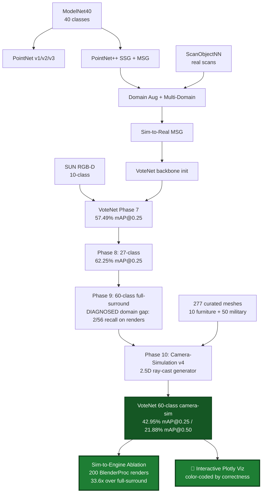

# 🎯 3D Object Detection using Machine Learning


**3D Object Detection** is an end-to-end research project that traces the evolution of point-cloud deep learning — from the original PointNet classifier, through PointNet++ multi-scale variants with sim-to-real domain adaptation, into a **VoteNet 3D detector**, and culminating in a **60-class camera-simulated (2.5D) detector** with a **measured, mechanism-explained sim-to-engine transfer** on a military + furniture taxonomy that has not previously been assembled.

The project spans **ten research phases**: point-cloud classification on ModelNet40, sim-to-real study on ScanObjectNN, VoteNet detection on SUN RGB-D, a 27-class custom detector, a 60-class expansion, and finally a camera-simulation redesign that closes a diagnosed train/test distribution gap and validates transfer on a real render engine (BlenderProc).

Built with **PyTorch, PointNet, PointNet++ MSG, VoteNet, BlenderProc, trimesh, Open3D, and Plotly**.

---

## 🏆 Headline Result (Phase 10)

A **60-class VoteNet** trained entirely on **camera-simulated 2.5D point clouds** — the same single-viewpoint geometry a real depth sensor produces — rather than the idealized full-surround clouds used in earlier phases.

| Benchmark | Metric | Value |
|---|---|---|
| **Synthetic 2.5D val** (1,500 held-out scenes) | **mAP@0.25** | **42.95%** |
| Synthetic 2.5D val | mAP@0.50 | 21.88% |
| Synthetic 2.5D val | AR@0.25 | 65.4% |
| Synthetic 2.5D val | small-object F1@10 cm (19 classes < 35 cm) | 46.8% |
| **Sim-to-engine transfer** (200 BlenderProc renders) | **camera-sim mAP@0.25** | **11.72%** |
| Sim-to-engine ablation | full-surround (Phase 9) mAP@0.25 | 0.35% |
| **Ablation improvement** | camera-sim vs. full-surround | **33.6×** |

The **33.6× ablation** — identical model architecture, identical rendered test scenes, only the *training distribution* swapped — is the project's core scientific contribution: it isolates the training distribution as the mechanism behind sim-to-engine transfer.

---

## ✨ Key Features

### 🔹 PointNet — From Scratch
- Implemented the original **PointNet** (Qi et al., 2017) from first principles in PyTorch.
- Trained across **v1 → v2 → v3**: baseline classifier → rotation/jitter/scale augmentation → dropout + regularization fix.
- Established the ModelNet40 classification baseline (~87%).

### 🔹 PointNet++ — Multi-Scale Feature Learning
- Implemented **PointNet++ SSG**, then upgraded to **MSG** (Multi-Scale Grouping) for hierarchical features.
- 100 epochs, cosine LR; MSG became the backbone for all downstream detection.

### 🔹 Sim-to-Real with Domain Augmentation
- Studied **ModelNet40 → ScanObjectNN** transfer via domain-augmented, fine-tuned, and multi-domain pipelines.
- Quantified per-class synthetic → real degradation; documented the zero-shot vs. fine-tuned gap.

### 🔹 VoteNet on SUN RGB-D — Real-World Detection
- Trained **VoteNet** (Qi et al., 2019) on the SUN RGB-D 10-class benchmark, warm-started from the multi-domain MSG backbone.
- Achieved **57.49% mAP@0.25**, matching the original paper.

### 🔹 27-Class VoteNet — Custom Furniture + Military Detector
- Extended VoteNet 10 → **27 classes** (10 furniture + 17 military), surgical weight transfer (144/146 layers from the SUN RGB-D checkpoint).
- Achieved **62.25% mAP@0.25 / 44.03% mAP@0.50** on full-surround synthetic val.

### 🔹 60-Class Expansion & the Diagnosed Domain Gap (Phase 9)
- Expanded the taxonomy 27 → **60 classes** (10 furniture + 50 military) on a **277-mesh curated dataset**.
- **Critical finding:** the full-surround-trained detector collapsed to **2/56-class recall** on BlenderProc-rendered depth scenes. Root cause was diagnosed as a **train/test distribution mismatch**, not a bug: the model trained on all-sides-visible point clouds but every realistic test source (a depth camera, a render) produces a **single-viewpoint 2.5D cloud** with self-occlusion and one dense wall plane. The model hallucinated large objects on wall planes and missed half-visible objects.

### 🔹 Camera-Simulation Redesign (Phase 10) — The Fix
- Rebuilt the synthetic generator to produce **2.5D depth-realistic clouds** by ray-casting a virtual RGB-D camera into each scene, so **training distribution ≈ engine/real distribution**:
  - single-viewpoint sampling with real self- and inter-object occlusion,
  - dense contiguous wall planes (labeled background — eliminating the "wall hallucination"),
  - 2 partial views merged per scene, 4 mm sensor noise, camera rig matched to the BlenderProc eval,
  - **visibility-QC labels** (objects with too few visible points are dropped, so the model is not punished for the genuinely invisible).
- Model upgrades: **small-object backbone patch** (SA1 seed points 2048 → 4096, finer radii), **inverse-size-weighted classification loss**, and an explicit **height feature** as the 4th input channel.
- Warm-started from the Phase 9 60-class checkpoint; **AdamW 1e-4 → cosine 1e-6, weight decay 1e-4, grad-clip 10, 40 epochs**, best checkpoint epoch 35 (val loss 7.4143).

### 🔹 Sim-to-Engine Evaluation & Ablation (Phase 10)
- Rendered **200 BlenderProc scenes** (mixed military rooms + tabletop close-ups) with saved depth, intrinsics, camera pose, and ground-truth boxes; backprojected to detector-format 2.5D clouds with sensor noise.
- **Ablation:** ran the Phase 9 (full-surround) and Phase 10 (camera-sim) checkpoints on the **same** rendered scenes. Full-surround = 0.35% mAP@0.25 (the Phase 9 collapse, reproduced); camera-sim = **11.72%** — a **33.6× improvement** and a **27.3% transfer ratio** relative to matched-distribution val.
- **Failure analysis** (honest, mechanism-level): a residual, order-of-magnitude-smaller wall-hallucination on rendered wall slabs (precision cost), and a **localization-limited** long-gun cluster (super-class AP ≈ mean of individual APs → the six long guns are detected but not boxed tightly enough at 0.25 IoU, driven by 30° heading quantization on thin geometry).

### 🔹 Interactive Plotly Visualization — The Final Deliverable
- Browser-interactive 3D viewer (`scripts/interactive_viz_plotly_v2.py`) rendering predictions on any validation scene with full rotate / zoom / pan, **color-coded by correctness** (not class):
  - 🟢 **Green** — correct (right class, IoU > 0.25 with a GT)
  - 🟠 **Orange** — wrong class (right location)
  - 🔴 **Red** — false positive
  - ⬛ **Black dashed** — ground truth found
  - 🟡 **Yellow dashed** — ground truth missed
- Live counts in the title bar; an extra class-agnostic NMS pass (`phase10_plotly_viz.ipynb`) collapses duplicate proposals so demos show one box per real object.
- Curated demo scenes span the full spectrum — best-case, densest, most-diverse, tiny-object success, military-heavy, and an honest worst-recall failure case.

---

## 📊 Results Summary

### Detection metrics by phase

| Phase | Model | Task | Metric | Value |
|---|---|---|---|---|
| 1–2 | PointNet v1/v2/v3 | ModelNet40 classification | accuracy | ~87% |
| 3 | PointNet++ SSG | ModelNet40 classification | accuracy | ~90% |
| 4 | PointNet++ MSG | ModelNet40 classification | accuracy | ~91% |
| 5 | PointNet++ MSG multi-domain | ScanObjectNN classification | accuracy | improvement over zero-shot |
| 6 | PointNet++ MSG | ScanObjectNN PB-T50-RS | confusion analysis | — |
| 7 | VoteNet | SUN RGB-D 10-class | **mAP@0.25** | **57.49%** |
| 7 | VoteNet | SUN RGB-D 10-class | mAP@0.50 | 32.94% |
| 8 | VoteNet 27-class | Full-surround synthetic | **mAP@0.25** | **62.25%** |
| 8 | VoteNet 27-class | Full-surround synthetic | mAP@0.50 | 44.03% |
| 9 | VoteNet 60-class (full-surround) | BlenderProc engine test | recall | **2/56 classes** (diagnosed domain gap) |
| **10** | **VoteNet 60-class (camera-sim 2.5D)** | **Synthetic 2.5D val** | **mAP@0.25** | **42.95%** |
| **10** | **VoteNet 60-class (camera-sim 2.5D)** | **Synthetic 2.5D val** | **mAP@0.50** | **21.88%** |
| **10** | **VoteNet 60-class (camera-sim 2.5D)** | **BlenderProc engine (200 scenes)** | **mAP@0.25** | **11.72%** |
| 10 | VoteNet 60-class (full-surround) | BlenderProc engine (200 scenes) | mAP@0.25 | 0.35% (ablation baseline) |

> **Note on comparing Phase 8 (62.25%) and Phase 10 (42.95%):** they are measured on different, non-comparable test distributions. Phase 8's val was *full-surround* (every object surface-sampled from all sides — an easy benchmark that flattered the model and hid the domain gap). Phase 10's val is *honest single-viewpoint 2.5D* — the geometry a real sensor actually produces. The lower headline number is measured on a strictly harder and more realistic task.

### Phase 10 — synthetic-val AP by object-size tier

| Tier | Definition | Classes | mean AP@0.25 |
|---|---|---|---|
| **Tier 1** | ≥ 1.0 m | 17 | **0.535** |
| **Tier 2** | 0.35 – 1.0 m | 24 | **0.453** |
| **Tier 3** | < 0.35 m | 19 | **0.306** |

Strong performers include hedgehog (0.89), mortar_tube (0.87), bed (0.81), barbed_wire_coil (0.94), duffel_bag (0.92), fuel_drum (0.90), helmet (0.76), first_aid_kit (0.68), tank_mine (0.61). The hardest classes are thin/elongated objects (rifle, shotgun, machete, baton) — a **localization** limitation confirmed by the long-gun super-class analysis, not a detection failure.

### Phase 10 — sim-to-engine ablation (the core figure)

| Training distribution | Engine mAP@0.25 (200 renders) |
|---|---|
| Full-surround (Phase 9) | 0.0035 |
| **Camera-sim 2.5D (Phase 10)** | **0.1172** |
| **Improvement** | **33.6×** |

---

## 🔄 System Pipeline



---

## 📥 Download Trained Models

Checkpoints are hosted on GitHub Releases to keep the repository lightweight.

| Model | Phase | Task | Metric |
|---|---|---|---|
| `pointnet_v3_modelnet40_aug_regfix_best.pt` | 1–2 | ModelNet40 classification | ~87% acc |
| `pointnetpp_ssg_modelnet40_best.pt` | 3 | ModelNet40 classification | ~90% acc |
| `pointnetpp_msg_best.pt` | 4 | ModelNet40 classification | ~91% acc |
| `pointnetpp_msg_multi_domain_best.pt` | 5 | Sim-to-real | — |
| `pointnetpp_msg_scanobjectnn_best.pt` | 6 | ScanObjectNN classification | — |
| `votenet_sunrgbd_best.pt` | 7 | SUN RGB-D detection | 57.49% mAP@0.25 |
| `votenet_27class_best.pt` | 8 | 27-class detection (full-surround) | 62.25% mAP@0.25 |
| **`votenet_60class_v4_best.pt`** | **10** | **60-class camera-sim (2.5D) detection** | **42.95% mAP@0.25** |

```bash
gh release download v3.0 --dir checkpoints/
```

```python
import torch
ckpt = torch.load('checkpoints/votenet_60class_v4_best.pt', map_location='cuda')
model.load_state_dict(ckpt['model_state_dict'])
```

---

## 🛠️ Technology Stack

- **Deep Learning:** PyTorch (≥1.13), PointNet, PointNet++ MSG, VoteNet
- **3D Geometry & Rendering:** trimesh, Open3D, BlenderProc (Blender/Cycles engine eval), numpy, scipy
- **Visualization:** Plotly (interactive 3D), matplotlib (curves, confusion heatmaps)
- **Training Infrastructure:** Kaggle (T4 ×2 GPU), Google Colab
- **CUDA:** pointnet2 C++/CUDA extensions (patched for modern PyTorch via `AT_CHECK → TORCH_CHECK`)
- **Datasets:** ModelNet40, ScanObjectNN PB-T50-RS, SUN RGB-D, custom 60-class synthetic (full-surround + 2.5D), BlenderProc renders

---

## 📈 Current Capabilities

- ✅ PointNet v1/v2/v3 and PointNet++ SSG/MSG classifiers from scratch
- ✅ Domain augmentation + multi-domain training for sim-to-real transfer
- ✅ VoteNet on SUN RGB-D matching the paper (57.49% mAP@0.25)
- ✅ 27-class VoteNet exceeding the paper on full-surround synthetic (62.25% mAP@0.25)
- ✅ **60-class taxonomy** (10 furniture + 50 military) — a novel military 3D taxonomy
- ✅ **Diagnosed the full-surround → 2.5D domain gap** (Phase 9 post-mortem)
- ✅ **Camera-simulation 2.5D generator** closing the gap at its source
- ✅ **60-class camera-sim detector: 42.95% mAP@0.25 on honest 2.5D val**
- ✅ **Sim-to-engine transfer measured on BlenderProc — 33.6× ablation over full-surround**
- ✅ Interactive Plotly visualizations color-coded by correctness — the final deliverable

---

## 🔮 Planned Improvements (v5)

- ⬜ **24 heading bins** (from 12) — halve angular quantization to recover thin/elongated-object mAP (rifle, shotgun, machete)
- ⬜ **Pure-wall training scenes (~10%)** — drive residual wall hallucination toward zero
- ⬜ **Closer-range camera rig (0.9–3.0 m) + MULTIVIEW=3** — cover tabletop close-up density, denser small objects
- ⬜ **Gun pose variety** in the generator (racked, leaning, wall-mounted) so long guns separate from support surfaces
- ⬜ **Real-world fine-tuning** — 50–100 labeled RGB-D scans for true sim-to-real evaluation
- ⬜ **Two-stage detector head** — region proposal + refinement to tighten mAP@0.50
- ⬜ **Pure-PyTorch backbone** — port pointnet2 ops to remove the CUDA dependency for Mac/edge inference

---

## 🎬 Reproducing the Final Phases

### Phase 10 — camera-simulation data (Mac, ~3.5 h overnight)
```bash
python scripts/generate_synthetic_dataset_v4.py --n-train 8000 --n-val 1500
# QC: confirm 2.5D property (dense walls, one-sided objects, height 0..~2.5 m)
```

### Phase 10 — training + evaluation (Kaggle T4 ×2, one commit)
```bash
# Attach: votenet-source, votenet-v4-25d (2.5D data), 60-class Phase 9 checkpoint
# Run phase10_training_v2.ipynb — setup -> verification gate -> warm start ->
#   40-epoch training -> auto-eval (mAP, tiers, F1@10cm, confusion, long-gun analysis)
#   -> produces votenet_60class_v4_best.pt (epoch 35, val 7.4143)
```

### Phase 10 — sim-to-engine ablation (Mac render + Kaggle eval)
```bash
# 1. Render 200 scenes (mixed rooms + tabletop close-ups)
blenderproc run scripts/blenderproc_render_scenes_v2.py -- --mode mixed    --n-scenes 140 --prefix m --out data/engine_renders_200
blenderproc run scripts/blenderproc_render_scenes_v2.py -- --mode tabletop --n-scenes 60  --prefix t --out data/engine_renders_200
python scripts/convert_renders_to_scenes.py --in-dir data/engine_renders_200 --out-dir data/engine_scenes_200
# 2. Upload engine_scenes_200 to Kaggle, run the ablation cells (A0-A3) in the eval notebook
#    -> full-surround vs camera-sim on the same scenes -> 33.6x
```

### Final visualization — interactive Plotly viewer
```bash
# Convert the eval pkl + local val scenes, curate demos, export standalone HTMLs
jupyter notebook phase10_plotly_viz.ipynb
# Drag to rotate, scroll to zoom, hover boxes for class + score
```

---

## 📁 Selected Structure (Phases 9–10 additions)

```
3D Object Detection/
├── phase10_training_v2.ipynb                   # Phase 10 train + auto-eval (60-class, 2.5D)
├── phase10_plotly_viz.ipynb                    # Interactive correctness-coded demos
├── scripts/
│   ├── generate_synthetic_dataset_v4.py           # Camera-simulation 2.5D generator
│   ├── blenderproc_render_scenes_v2.py            # Engine-eval renderer (mixed/tabletop/floor)
│   ├── convert_renders_to_scenes.py               # Renders -> detector-format 2.5D clouds
│   ├── make_engine_demos.py                       # Engine-scene Plotly demos
│   ├── make_val_demos.py                          # Synthetic-val Plotly demos
│   └── interactive_viz_plotly_v2.py               # Core correctness-coded 3D viewer
├── checkpoints/
│   ├── votenet_27class_best.pt                     # Phase 8 (full-surround, 27-class)
│   └── votenet_60class_v4_best.pt                  # Phase 10 (camera-sim 2.5D, 60-class)
├── PHASE9_MASTER_PLAN.md
├── PHASE10_MASTER_PLAN.md
└── PHASE10_SIM_TO_ENGINE_REPORT.md             # Method, 5 result blocks, failure analysis
```

---

## 👤 Author

**Vatsy (Vathsal Upadhyay)** — 3D Computer Vision Internship, 2026

Built across ten phases spanning point-cloud classification, sim-to-real transfer, 3D object detection, and a diagnosed-and-fixed sim-to-engine domain gap validated on a real render engine. The novelty is the 60-class military taxonomy combined with a clean, measured, mechanism-explained sim-to-engine transfer — a result whose contribution is the *understanding*, not merely the number.
