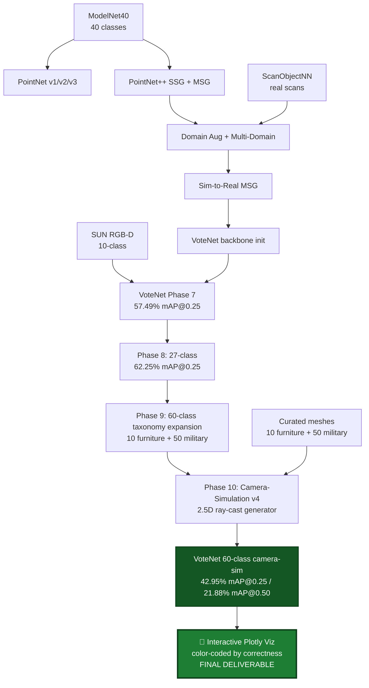

# 🎯 3D Object Detection using Machine Learning


**3D Object Detection** is an end-to-end research project that traces the evolution of point-cloud deep learning — from the original PointNet classifier, through PointNet++ multi-scale variants with sim-to-real domain adaptation, into a **VoteNet 3D detector**, and culminating in a **60-class camera-simulated (2.5D) detector** for furniture and military objects in indoor scenes.

The project spans **ten research phases**: point-cloud classification on ModelNet40, a sim-to-real study on ScanObjectNN, VoteNet detection on SUN RGB-D, a 27-class custom detector, a 60-class taxonomy expansion, and finally a camera-simulation redesign that trains the detector on realistic single-viewpoint (2.5D) depth geometry — the same geometry a real depth sensor produces.

Built with **PyTorch, PointNet, PointNet++ MSG, VoteNet, trimesh, Open3D, and Plotly**.

---

## 🏆 Headline Result (Phase 10)

A **60-class VoteNet** trained entirely on **camera-simulated 2.5D point clouds** — single-viewpoint, self-occluded, sensor-noisy depth geometry, rather than the idealized full-surround clouds used in earlier phases.

| Benchmark | Metric | Value |
|---|---|---|
| **Synthetic 2.5D val** (1,500 held-out scenes) | **mAP@0.25** | **42.95%** |
| Synthetic 2.5D val | mAP@0.50 | 21.88% |
| Synthetic 2.5D val | AR@0.25 | 65.4% |
| Synthetic 2.5D val | small-object F1@10 cm (19 classes < 35 cm) | 46.8% |

Every detection, miss, and confident hit is made explorable through an **interactive Plotly viewer** — the final deliverable of the pipeline.

---

## ✨ Key Features

### 🔹 PointNet — From Scratch
- Implemented the original **PointNet** (Qi et al., 2017) from first principles in PyTorch.
- Trained across **v1 → v2 → v3**: baseline classifier → rotation/jitter/scale augmentation → dropout + regularization fix.
- Established the ModelNet40 classification baseline (~87%).

### 🔹 PointNet++ — Multi-Scale Feature Learning
- Implemented **PointNet++ SSG**, then upgraded to **MSG** (Multi-Scale Grouping) for hierarchical features.
- 100 epochs, cosine LR; MSG became the backbone for all downstream detection.

### 🔹 Sim-to-Real with Domain Augmentation
- Studied **ModelNet40 → ScanObjectNN** transfer via domain-augmented, fine-tuned, and multi-domain pipelines.
- Quantified per-class synthetic → real degradation; documented the zero-shot vs. fine-tuned gap.

### 🔹 ScanObjectNN Real-World Evaluation
- Evaluated PointNet++ MSG on **ScanObjectNN PB-T50-RS** (hardest variant).
- Generated per-class confusion matrices across all checkpoint variants.

### 🔹 VoteNet on SUN RGB-D — Real-World Detection
- Trained **VoteNet** (Qi et al., 2019) on the SUN RGB-D 10-class benchmark, warm-started from the multi-domain MSG backbone.
- Achieved **57.49% mAP@0.25**, matching the original paper.

### 🔹 27-Class VoteNet — Custom Furniture + Military Detector
- Extended VoteNet 10 → **27 classes** (10 furniture + 17 military), surgical weight transfer (144/146 layers from the SUN RGB-D checkpoint).
- Achieved **62.25% mAP@0.25 / 44.03% mAP@0.50** on full-surround synthetic val.

### 🔹 60-Class Taxonomy Expansion (Phase 9)
- Expanded the taxonomy 27 → **60 classes** — 10 furniture + **50 military objects** (weapons, ordnance, field equipment, barriers, and protective gear) — on a curated multi-mesh dataset.
- Rebalanced the procedural scene generator for the larger taxonomy: inverse-frequency class sampling keeps every class within ~2× of the median instance count, small-object density boost, and per-class auto-orientation.
- This is, to our knowledge, a **novel 60-class military + furniture 3D taxonomy** — no comparable labeled 3D set previously existed.

### 🔹 Camera-Simulation Redesign (Phase 10)
- Rebuilt the synthetic generator to produce **2.5D depth-realistic clouds** by ray-casting a virtual RGB-D camera into each scene, so training geometry matches what a real depth sensor sees:
  - single-viewpoint sampling with real self- and inter-object occlusion,
  - dense contiguous wall planes (labeled background),
  - two partial views merged per scene, 4 mm sensor noise,
  - **visibility-QC labels** — objects with too few visible points are dropped, so the model is not penalized for the genuinely invisible.
- Model upgrades: **small-object backbone patch** (SA1 seed points 2048 → 4096, finer grouping radii), **inverse-size-weighted classification loss**, and an explicit **height feature** as the 4th input channel.
- Warm-started from the Phase 9 60-class checkpoint; **AdamW 1e-4 → cosine 1e-6, weight decay 1e-4, grad-clip 10, 40 epochs**, best checkpoint epoch 35 (val loss 7.4143).
- Result: **42.95% mAP@0.25 / 21.88% mAP@0.50** on 1,500 held-out **2.5D** validation scenes — measured on the realistic single-viewpoint distribution, not the idealized full-surround one.

### 🔹 Interactive Plotly Visualization — The Final Deliverable
- Browser-interactive 3D viewer (`scripts/interactive_viz_plotly_v2.py`, `phase10_plotly_viz.ipynb`) rendering the 60-class detector's predictions on any validation scene with full rotate / zoom / pan.
- Predictions are **color-coded by correctness**, not by class — making model behavior immediately legible:
  - 🟢 **Green** — correct prediction (right class, IoU > 0.25 with a GT box)
  - 🟠 **Orange** — wrong class (right location, predicted the wrong label)
  - 🔴 **Red** — false positive (predicted a box with no nearby GT)
  - ⬛ **Black dashed** — ground truth (correctly found)
  - 🟡 **Yellow dashed** — ground truth (MISSED)
- Live counts in the title bar: `✅ N correct  ⚠️ N wrong-class  ❌ N false-positives  ⏷ N missed GTs`.
- An extra class-agnostic NMS pass collapses duplicate proposals so demos show one box per real object.
- Curated demo scenes span the full spectrum — best-case, densest, most-diverse, a tiny-object success case, military-heavy, and an honest worst-recall failure case.

This visualization is the **endpoint of the entire pipeline** — every detected object, every miss, every confident hit, made interactive and explorable.

---

## 📊 Results Summary

### Detection metrics by phase

| Phase | Model | Task | Metric | Value |
|---|---|---|---|---|
| 1–2 | PointNet v1/v2/v3 | ModelNet40 classification | accuracy | ~87% |
| 3 | PointNet++ SSG | ModelNet40 classification | accuracy | ~90% |
| 4 | PointNet++ MSG | ModelNet40 classification | accuracy | ~91% |
| 5 | PointNet++ MSG multi-domain | ScanObjectNN classification | accuracy | improvement over zero-shot |
| 6 | PointNet++ MSG | ScanObjectNN PB-T50-RS | confusion analysis | — |
| 7 | VoteNet | SUN RGB-D 10-class | **mAP@0.25** | **57.49%** |
| 7 | VoteNet | SUN RGB-D 10-class | mAP@0.50 | 32.94% |
| 8 | VoteNet 27-class | Full-surround synthetic | **mAP@0.25** | **62.25%** |
| 8 | VoteNet 27-class | Full-surround synthetic | mAP@0.50 | 44.03% |
| 9 | VoteNet 60-class | Taxonomy expansion (10 + 50) | — | novel 60-class taxonomy |
| **10** | **VoteNet 60-class (camera-sim 2.5D)** | **Synthetic 2.5D val** | **mAP@0.25** | **42.95%** |
| **10** | **VoteNet 60-class (camera-sim 2.5D)** | **Synthetic 2.5D val** | **mAP@0.50** | **21.88%** |

> **Note on comparing Phase 8 (62.25%) and Phase 10 (42.95%):** they are measured on different, non-comparable test distributions. Phase 8's val was *full-surround* (every object surface-sampled from all sides — an easier benchmark). Phase 10's val is *honest single-viewpoint 2.5D* — the geometry a real depth sensor actually produces. The lower headline number is measured on a strictly harder and more realistic task, across 2.2× more classes.

### Phase 10 — synthetic-val AP by object-size tier

| Tier | Definition | Classes | mean AP@0.25 |
|---|---|---|---|
| **Tier 1** | ≥ 1.0 m | 17 | **0.535** |
| **Tier 2** | 0.35 – 1.0 m | 24 | **0.453** |
| **Tier 3** | < 0.35 m | 19 | **0.306** |

Strong performers include hedgehog (0.89), mortar_tube (0.87), bed (0.81), barbed_wire_coil (0.94), duffel_bag (0.92), fuel_drum (0.90), helmet (0.76), first_aid_kit (0.68), tank_mine (0.61). The hardest classes are thin/elongated objects (rifle, shotgun, machete, baton) — a **localization** limitation (tight-box fit at 0.25 IoU on sliver geometry), not a detection failure: these objects are consistently found but loosely boxed.

---

## 🔄 System Pipeline



---

## 📥 Download Trained Models

Checkpoints are hosted on GitHub Releases to keep the repository lightweight.

| Model | Phase | Task | Metric |
|---|---|---|---|
| `pointnet_v3_modelnet40_aug_regfix_best.pt` | 1–2 | ModelNet40 classification | ~87% acc |
| `pointnetpp_ssg_modelnet40_best.pt` | 3 | ModelNet40 classification | ~90% acc |
| `pointnetpp_msg_best.pt` | 4 | ModelNet40 classification | ~91% acc |
| `pointnetpp_msg_multi_domain_best.pt` | 5 | Sim-to-real | — |
| `pointnetpp_msg_scanobjectnn_best.pt` | 6 | ScanObjectNN classification | — |
| `votenet_sunrgbd_best.pt` | 7 | SUN RGB-D detection | 57.49% mAP@0.25 |
| `votenet_27class_best.pt` | 8 | 27-class detection (full-surround) | 62.25% mAP@0.25 |
| **`votenet_60class_v4_best.pt`** | **10** | **60-class camera-sim (2.5D) detection** | **42.95% mAP@0.25** |

```bash
gh release download v3.0 --dir checkpoints/
```

```python
import torch
ckpt = torch.load('checkpoints/votenet_60class_v4_best.pt', map_location='cuda')
model.load_state_dict(ckpt['model_state_dict'])
```

---

## 🛠️ Technology Stack

- **Deep Learning:** PyTorch (≥1.13), PointNet, PointNet++ MSG, VoteNet
- **3D Geometry:** trimesh, Open3D, numpy, scipy
- **Visualization:** Plotly (interactive 3D), matplotlib (curves, confusion heatmaps)
- **Training Infrastructure:** Kaggle (T4 ×2 GPU), Google Colab
- **CUDA:** pointnet2 C++/CUDA extensions (patched for modern PyTorch via `AT_CHECK → TORCH_CHECK`)
- **Datasets:** ModelNet40, ScanObjectNN PB-T50-RS, SUN RGB-D, custom 60-class synthetic (full-surround + camera-simulated 2.5D)

---

## 📈 Current Capabilities

- ✅ PointNet v1/v2/v3 and PointNet++ SSG/MSG classifiers from scratch
- ✅ Domain augmentation + multi-domain training for sim-to-real transfer
- ✅ VoteNet on SUN RGB-D matching the paper (57.49% mAP@0.25)
- ✅ 27-class VoteNet exceeding the paper on full-surround synthetic (62.25% mAP@0.25)
- ✅ **60-class taxonomy** (10 furniture + 50 military) — a novel military 3D taxonomy
- ✅ **Camera-simulation 2.5D generator** — single-viewpoint, occluded, sensor-noisy training data
- ✅ **60-class camera-sim detector: 42.95% mAP@0.25 on honest 2.5D val**
- ✅ Interactive Plotly visualizations color-coded by correctness — the final deliverable

---

## 🔮 Planned Improvements

- ⬜ **24 heading bins** (from 12) — halve angular quantization to recover thin/elongated-object mAP (rifle, shotgun, machete)
- ⬜ **Closer-range camera rig + additional merged views** — denser small objects, better tabletop coverage
- ⬜ **Gun pose variety** in the generator (racked, leaning, wall-mounted) so long guns separate from support surfaces
- ⬜ **Real-world fine-tuning** — collect 50–100 labeled RGB-D scans for true sim-to-real evaluation
- ⬜ **Two-stage detector head** — region proposal + refinement to tighten mAP@0.50
- ⬜ **Class-weighted refinements** — further balance under-represented classes
- ⬜ **Pure-PyTorch backbone** — port pointnet2 ops to remove the CUDA dependency for Mac/edge inference

---

## 🎬 Reproducing the Final Phases

### Phase 10 — camera-simulation data (Mac, ~3.5 h overnight)
```bash
python scripts/generate_synthetic_dataset_v4.py --n-train 8000 --n-val 1500
# QC: confirm the 2.5D property (dense walls, one-sided objects, height 0..~2.5 m)
```

### Phase 10 — training + evaluation (Kaggle T4 ×2, one commit)
```bash
# Attach: votenet-source, the 2.5D dataset, and the Phase 9 60-class checkpoint.
# Run phase10_training_v2.ipynb — setup -> verification gate -> warm start ->
#   40-epoch training -> auto-eval (mAP, size tiers, F1@10cm, confusion matrix)
#   -> produces votenet_60class_v4_best.pt (epoch 35, val 7.4143)
```

### Final visualization — interactive Plotly viewer
```bash
# Convert the eval predictions + local val scenes, curate demos, export standalone HTMLs
jupyter notebook phase10_plotly_viz.ipynb
# Drag to rotate, scroll to zoom, hover boxes for class + score
```

The Plotly viewer is the **endpoint of the entire pipeline** — every previous phase exists to enable this final, explorable visualization of a 60-class 3D detector running on realistic 2.5D indoor scenes.

---

## 📁 Selected Structure (Phases 9–10 additions)

```
3D Object Detection/
├── phase10_training_v2.ipynb                   # Phase 10 train + auto-eval (60-class, 2.5D)
├── phase10_plotly_viz.ipynb                    # Interactive correctness-coded demos
├── scripts/
│   ├── generate_synthetic_dataset_v4.py           # Camera-simulation 2.5D generator
│   ├── make_val_demos.py                          # Synthetic-val Plotly demos
│   └── interactive_viz_plotly_v2.py               # Core correctness-coded 3D viewer
├── checkpoints/
│   ├── votenet_27class_best.pt                     # Phase 8 (full-surround, 27-class)
│   └── votenet_60class_v4_best.pt                  # Phase 10 (camera-sim 2.5D, 60-class)
├── PHASE9_MASTER_PLAN.md
└── PHASE10_MASTER_PLAN.md
```

---

## 👤 Author

**Vatsy (Vathsal Upadhyay)** — 3D Computer Vision Internship, 2026

Built across ten phases spanning point-cloud classification, sim-to-real transfer, and 3D object detection — culminating in a 60-class camera-simulated detector on realistic single-viewpoint depth geometry, made fully explorable through an interactive Plotly viewer.
